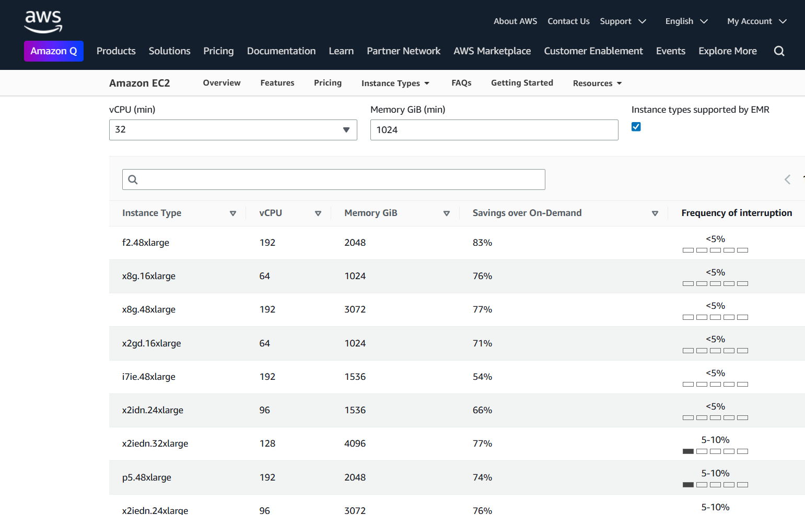
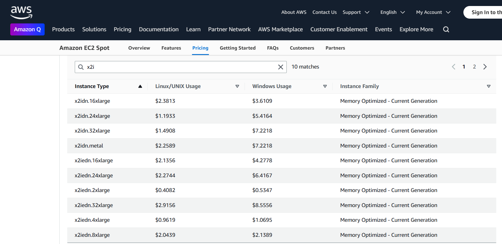

## EC2 Spot Instance for Big Data Analytics

```{r sync-renv-bash}

library(jsonlite)
library(here)

cwd <- here::here()

Sys.setenv("CWD"=cwd)

```

### AWS EC2 Spot Advisor

-   This section provides a comparison between x2idn and x2iedn instance types. These are high-memory instances suitable for memory-intensive workloads. The table below shows key differences in specifications and use cases

| Feature | x2idn | x2iedn |
|------------------------|------------------------|------------------------|
| Architecture | x86_64 (Intel Cascade Lake) | Same |
| Memory per vCPU | \~8 GiB per vCPU | \~16 GiB per vCPU (2x more) |
| Memory (e.g. 16xlarge) | 512 GiB | 1,024 GiB |
| vCPUs (16xlarge) | 64 | 64 |
| Instance Storage | 1 x 1.9 TB NVMe SSD | 2 x 1.5 TB NVMe SSDs |
| Network Bandwidth | Up to 50 Gbps | Up to 100 Gbps |
| Use Case Focus | Cost-optimized memory | Max memory performance + bandwidth |
| ENA Express | No | Yes (lower latency, higher throughput) |
| Price | Lower | Higher (due to more memory, network, storage) |

-   Use case recommendations based on instance type characteristics:

Use x2idn if: - You're looking for a cost-effective high-memory instance - Your workload needs high memory but not the absolute maximum memory bandwidth - You're okay with 8 GiB/vCPU and lower network/storage

Use x2iedn if: - You need 1 TB+ of RAM and super-fast I/O - You're running in-memory databases (SAP HANA, Redis, etc.) - You're processing large model training, graph analytics, or real-time analytics - You want highest bandwidth & lowest latency networking



<https://aws.amazon.com/ec2/spot/instance-advisor/>

```{r}
browseURL('https://aws.amazon.com/ec2/spot/instance-advisor/')
```

#### Valid Image Types

```{bash}

aws.exe ec2 describe-images \
  --image-ids ami-0b86aaed8ef90e45f \
  --query 'Images[0].Architecture'

```
```{bash}

aws.exe ssm get-parameters --names /aws/service/ami-amazon-linux-latest/amzn2-ami-hvm-x86_64-gp2 \
  --region us-east-1 --query 'Parameters[0].Value' --output text

```
```{bash }

aws.exe ec2 describe-images --image-ids ami-09f4814ae750baed6 --region us-east-1 \
  --query 'Images[0].[Architecture,PlatformDetails,ImageLocation]'

```


#### Spot Pricing



```{r}
browseURL('https://aws.amazon.com/ec2/spot/pricing/')
```


```{bash}

aws.exe ec2 describe-spot-price-history \
  --instance-types x2idn.24xlarge \
  --product-descriptions "Linux/UNIX" \
  --start-time $(date -u +"%Y-%m-%dT%H:%M:%SZ") \
  --region us-east-1 \
  --query "SpotPriceHistory[*].[InstanceType,AvailabilityZone,SpotPrice]" \
  --output table

```

Note: No big price difference from 16xlarge and 24xlarge but 24xlarge is more available and therefore cheaper in a few sub-regions

-   Lowest price Instance Type

```{bash}

instance_type=$(aws.exe ec2 describe-spot-price-history \
  --instance-types x2idn.24xlarge \
  --product-descriptions "Linux/UNIX" \
  --start-time $(date -u +"%Y-%m-%dT%H:%M:%SZ") \
  --region us-east-1 \
  --query "sort_by(SpotPriceHistory, &SpotPrice)[0].[InstanceType]" \
  --output text)
  
echo "$instance_type"
echo "$instance_type" > instance.txt

```

-   Lowest Price Availability Zone

```{bash}

availability_zone=$(aws.exe ec2 describe-spot-price-history \
  --instance-types x2idn.24xlarge \
  --product-descriptions "Linux/UNIX" \
  --start-time $(date -u +"%Y-%m-%dT%H:%M:%SZ") \
  --region us-east-1 \
  --query "sort_by(SpotPriceHistory, &SpotPrice)[0].[AvailabilityZone]" \
  --output text)
  
echo "$availability_zone"
echo "$availability_zone" > zone.txt

```

-   Subnet for Lowest Price Instance

```{bash}

zone_id=$(cat zone.txt)
availability_zone=$(cat zone.txt)

aws.exe ec2 describe-subnets \
  --filters "Name=availability-zone,Values=$availability_zone" \
  --query 'Subnets[*].[SubnetId,AvailabilityZone]' \
  --output table

```

```{bash}

zone_id=$(cat zone.txt)

subnet_id=$(aws.exe ec2 describe-subnets \
  --filters "Name=availability-zone,Values=$zone_id" \
  --query 'Subnets[*].[SubnetId][0]' \
  --output text)

echo "$subnet_id"
echo "$subnet_id" > subnet.txt

```

### Spot Request (One Time)

Instance specifications: OS: Linux 2 AMI-ID: ami-0b86aaed8ef90e45f

Spot instance configurations:

-   Network interface setup with public IP, subnet id
-   EBS volume configuration with encryption
-   Instance profile for IAM roles
-   Spot instance market options
-   User data script for bootstrap configuration


```{bash}

aws ec2 run-instances \
  --image-id "ami-0953476d60561c955" \
  --instance-type "x2iedn.8xlarge" \
  --key-name "mushin_pgx" \
  --block-device-mappings '{
    "DeviceName": "/dev/xvda",
    "Ebs": {
      "Encrypted": true,
      "DeleteOnTermination": true,
      "Iops": 3000,
      "KmsKeyId": "alias/aws/ebs",
      "SnapshotId": "snap-0066a3d98840265c3",
      "VolumeSize": 200,
      "VolumeType": "gp3",
      "Throughput": 125
    }
  }' \
  --network-interfaces '{
    "AssociatePublicIpAddress": true,
    "DeviceIndex": 0,
    "Groups": ["sg-0eb0da772c42415dd"]
  }' \
  --tag-specifications '{
    "ResourceType": "instance",
    "Tags": [{"Key": "Name", "Value": "pgx-model-builder"}]
  }' \
  --iam-instance-profile '{"Arn":"arn:aws:iam::535362115856:instance-profile/EC2_Spot"}' \
  --instance-market-options '{"MarketType":"spot"}' \
  --metadata-options '{"HttpEndpoint":"enabled","HttpPutResponseHopLimit":2,"HttpTokens":"optional"}' \
  --private-dns-name-options '{
    "HostnameType": "ip-name",
    "EnableResourceNameDnsARecord": true,
    "EnableResourceNameDnsAAAARecord": false
  }' \
  --user-data file://bootstrap/jupyter.sh \
  --count 1

```

#### Spot Request (dynamic)

```{bash}

instance_type=$(cat instance.txt)

aws.exe ec2 run-instances \
    --image-id "ami-09f4814ae750baed6" \
    --instance-type $instance_type \
    --key-name "mushin_pgx" \
    --block-device-mappings '[
        {
            "DeviceName": "/dev/xvda",
            "Ebs": {
                "Encrypted": true,
                "DeleteOnTermination": true,
                "Iops": 3000,
                "KmsKeyId": "alias/aws/ebs",
                "VolumeSize": 97,
                "VolumeType": "gp3",
                "Throughput": 125
            }
        }
    ]' \
    --network-interfaces '[{"AssociatePublicIpAddress":true,"DeviceIndex":0,"SubnetId":"subnet-767e4611","Groups":["sg-07506ffd66bfd33b7"]}]'  \
    --capacity-reservation-specification '{"CapacityReservationPreference":"open"}' \
    --tag-specifications '[
        {
            "ResourceType":"instance",
            "Tags":[{"Key":"Name","Value":"ADE Model Builder"}]
        }
    ]' \
    --iam-instance-profile '{"Arn":"arn:aws:iam::535362115856:instance-profile/EC2_Spot"}' \
    --instance-market-options '{"MarketType":"spot"}' \
    --metadata-options '{"HttpEndpoint":"enabled","HttpPutResponseHopLimit":2,"HttpTokens":"optional"}' \
    --private-dns-name-options '{"HostnameType":"ip-name","EnableResourceNameDnsARecord":true,"EnableResourceNameDnsAAAARecord":false}' \
    --maintenance-options '{"AutoRecovery":"default"}' \
    --user-data file://bootstrap/ec2_linux2_single.sh \
    --count "1"

```

### Spot Request (Persistent)

```{bash}

aws ec2 run-instances \
  --image-id "ami-0953476d60561c955" \
  --instance-type "x2iedn.8xlarge" \
  --key-name "mushin_pgx" \
  --block-device-mappings '{
    "DeviceName": "/dev/xvda",
    "Ebs": {
      "Encrypted": true,
      "DeleteOnTermination": true,
      "Iops": 3000,
      "KmsKeyId": "alias/aws/ebs",
      "SnapshotId": "snap-0066a3d98840265c3",
      "VolumeSize": 197,
      "VolumeType": "gp3",
      "Throughput": 125
    }
  }' \
  --network-interfaces '{
    "AssociatePublicIpAddress": true,
    "DeviceIndex": 0,
    "Groups": ["sg-0eb0da772c42415dd"]
  }' \
  --tag-specifications '{
    "ResourceType": "instance",
    "Tags": [
      { "Key": "Name", "Value": "pgx-model-builder" }
    ]
  }' \
  --iam-instance-profile '{
    "Arn": "arn:aws:iam::535362115856:instance-profile/EC2_Spot"
  }' \
  --instance-market-options '{
    "MarketType": "spot",
    "SpotOptions": {
      "InstanceInterruptionBehavior": "stop",
      "SpotInstanceType": "persistent"
    }
  }' \
  --metadata-options '{
    "HttpEndpoint": "enabled",
    "HttpPutResponseHopLimit": 2,
    "HttpTokens": "optional"
  }' \
  --private-dns-name-options '{
    "HostnameType": "ip-name",
    "EnableResourceNameDnsARecord": true,
    "EnableResourceNameDnsAAAARecord": false
  }' \
  --user-data file://bootstrap/jupyter.sh \
  --count 1


```

